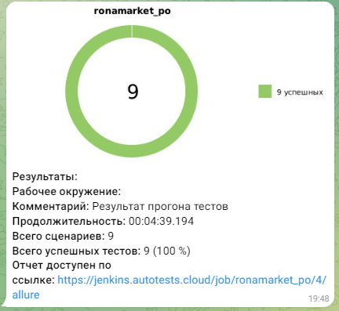

# Проект по автоматизации тестирования интернет-магазина Rona Market (https://rona.market/)


## **Содержание:**
____

* <a href="#tools">Технологии и инструменты</a>

* <a href="#cases">Примеры автоматизированных тест-кейсов</a>

* <a href="#jenkins">Сборка в Jenkins</a>

* <a href="#console">Запуск из терминала</a>

* <a href="#allure">Allure отчет</a>

* <a href="#allure-testops">Интеграция с Allure TestOps</a>

* <a href="#jira">Интеграция с Jira</a>

* <a href="#telegram">Уведомление в Telegram при помощи бота</a>

* <a href="#video">Примеры видео выполнения тестов на Selenoid</a>
____
<a id="tools"></a>
## <a name="Технологии и инструменты">**Технологии и инструменты:**</a>

<p align="center">  
<a href="https://www.jetbrains.com/idea/"></a>  
<a href="https://www.java.com/"></a>  
<a href="https://github.com/"></a>  
<a href="https://junit.org/junit5/"></a>  
<a href="https://gradle.org/"></a>  
<a href="https://selenide.org/"></a>  
<a href="https://aerokube.com/selenoid/"></a>  
<a href="ht[images](images)tps://github.com/allure-framework/allure2"></a> 
<a href="https://qameta.io/"></a>   
<a href="https://www.jenkins.io/"></a>  
<a href="https://www.atlassian.com/ru/software/jira/"></a>  
</p>

____
<a id="cases"></a>
## <a name="Примеры автоматизированных тест-кейсов">**Примеры автоматизированных тест-кейсов:**</a>
____
- ✓ *Проверка успешной авторизации*
- ✓ *Проверка неуспешной авторизации*
- ✓ *Проверка добавления товара в избранное*
- ✓ *Прповерка карточки товара'*
- ✓ *Проверка поисковой выдачи*
- ✓ *ППроверка добавления товара в корзину*


____
##  Сборка в Jenkins
____
Для запуска сборки необходимо перейти в раздел <code>Собрать с параметрами</code> и нажать кнопку <code>Собрать</code>.
<p align="center">

</p>
После выполнения сборки, в блоке <code>История сборок</code> напротив номера сборки появятся значки <code>Allure Report</code> и <code>Allure TestOps</code>, при клике на которые откроется страница с сформированным html-отчетом и тестовой документацией соответственно.


### **Параметры сборки в Jenkins:**

- *browser (браузер, по умолчанию chrome)*
- *browserVersion (версия браузера, по умолчанию 100.0)*
- *browserSize (размер окна браузера, по умолчанию 1920x1080)*
- *baseUrl (адрес тестируемого веб-сайта)*
- *remoteUrl (логин, пароль и адрес удаленного сервера Selenoid)*

<a id="console"></a>
## Команды для запуска из терминала
___
***Локальный запуск:***
```bash  
gradle clean smoke_test
```

***Удалённый запуск через Jenkins:***
```bash  
clean smoke_test
"-Dbrowser=${browser}"
"-DbrowserVersion=${browserVersion}"
"-DbrowserSize=${browserSize}"
"-DbaseUrl=${baseUrl}"
"-DremoteUrl=${remoteUrl}"
```
___
<a id="allure"></a>
##  Allure-отчет
___

### *Основная страница отчёта*

<p align="center">  
  
</p>  

### *Тест-кейсы*

<p align="center">  
  
</p>

___
<a id="allure-testops"></a>
##  Интеграция с Allure TestOps

На *Dashboard* в <code>Allure TestOps</code> отображается статистика прогона автотестов и  результаты прогона приходят по интеграции при каждом запуске сборки.

### Результат выполнения автотеста

<p align="center">

</p>
____

___
<a id="jira"></a>
##  Интеграция с Jira

Реализована интеграция <code>Allure TestOps</code> с <code>Jira</code>, в тикете отображается, какие тест-кейсы были написаны в рамках задачи и результат их прогона.
____
<p align="center">  
  
</p>

____
<a id="telegram"></a>
## </a> Уведомление в Telegram 
____
<p align="center">  
  
</p>

____
<a id="video"></a>
## </a> Видео выполнения тестов на Selenoid
____
<p align="center">
   
</p>

